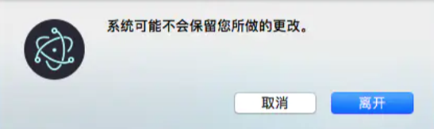

当浏览器窗口关闭时触发beforeunload事件，并在beforeunload事件中添加event.returnValue = "";试图阻止浏览器关闭时，并未如期出现 以下弹框：


原因：https://electronjs.org/docs/api/web-contents#event-will-prevent-unload

'will-prevent-unload' Emitted when a beforeunload event handler is attempting to cancel a page unload.因此浏览器的beforeunload事件会被electron的will-prevent-unload事件捕获，当beforeunload事件发生时，我们可以在electron中添加will-prevent-unload事件的处理：

```javascript
win.webContents.on('will-prevent-unload', (event) => {
      const choice = dialog.showMessageBox(winMain, {
        type: 'question',
        buttons: ['离开', '取消'],
        title: '离开此网站?',
        message: '系统可能不会保留您所做的更改。',
        defaultId: 0,
        cancelId: 1
      })
      const leave = (choice === 0)
      if (leave) {
        event.preventDefault()
      }
   })
```

通过electron自定义弹框来限制是否退出

