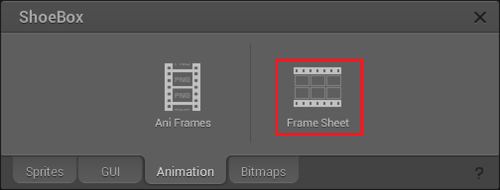
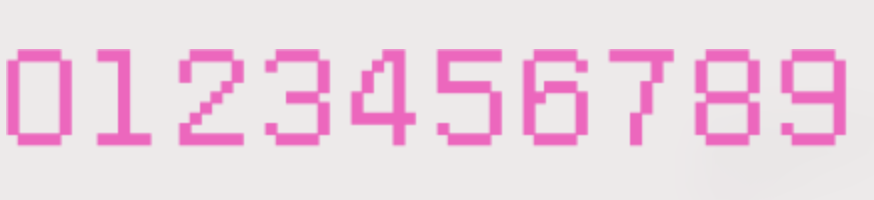
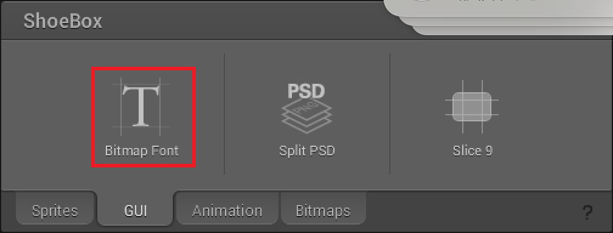
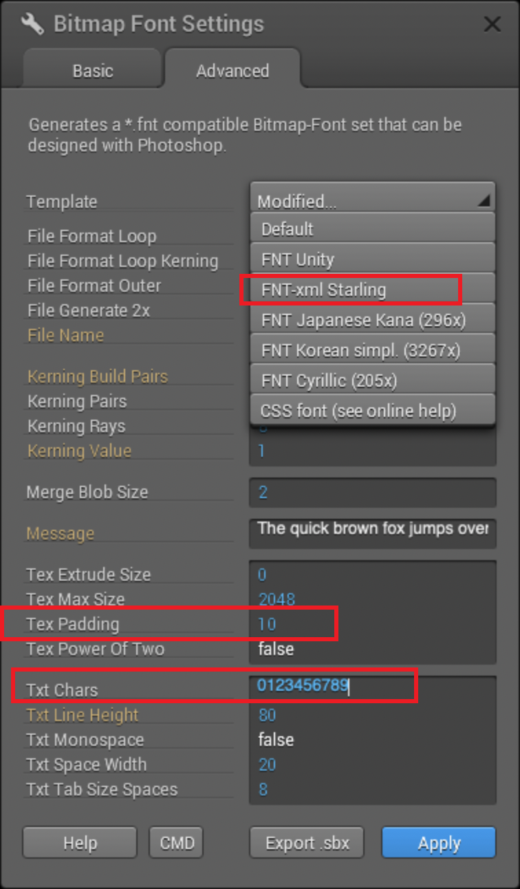
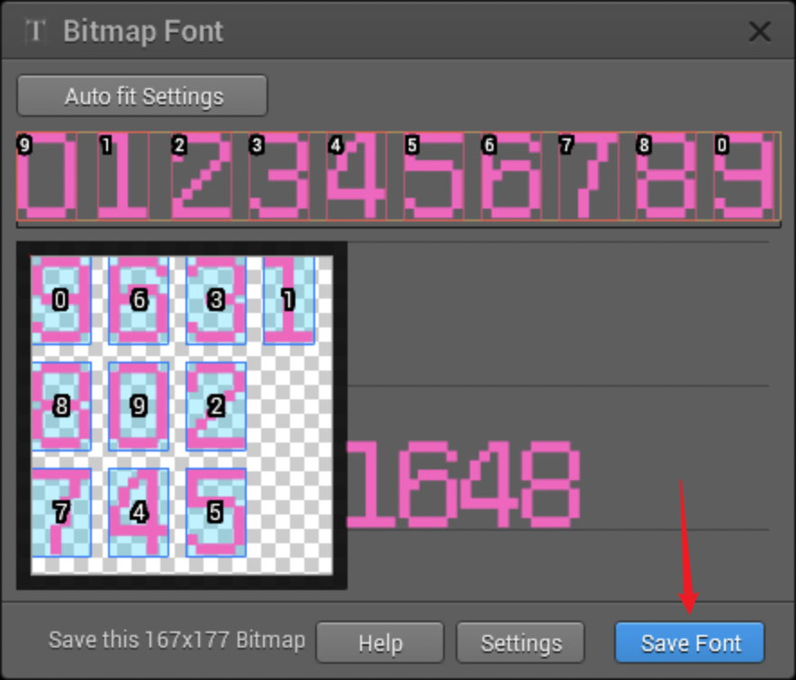
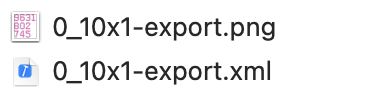

## 制作一个0~9的数字BitmapFont

1. 准备0~9的10张png

2. 使用 Animation -> Frame Sheet 生成一个0~9的合集png
   
   

3. 使用刚刚的合集图片生成Bitmap Font
   

4. 选择xml模板，修改padding为10，修改 txt  chars为 0~9
   
   >注意调整行高（Line Height）和 字间距（Kerning Value）

   调整File Format Loop:
   
   ```javascript
   \t\t<char id="@id" x="@x" y="@y" width="@w" height="@h" xoffset="@sx" yoffset="@sy" xadvance="@advanceX" letter="@letter" /><!-- @letter -->
   ```

   

5. 点击保存，得到 png 和 xml 文件 
   
   

6. 在项目中使用
   
  ```javascript
  let value = 0;

   class Example extends Phaser.Scene
   {
       constructor ()
       {
           super();
       }

       preload ()
       {
           this.load.bitmapFont('desyrel', 'assets/fonts/bitmap/desyrel.png', 'assets/fonts/bitmap/desyrel.xml');
       }

       create ()
       {
           this.dynamic = this.add.bitmapText(0, 500, 'desyrel', '');
       }

       update ()
       {
           this.dynamic.text = 'value: ' + value.toFixed(2);
           value += 0.01;
       }
   }

   const config = {
       type: Phaser.WEBGL,
       parent: 'phaser-example',
       scene: [ Example ]
   };

   const game = new Phaser.Game(config);
  ```